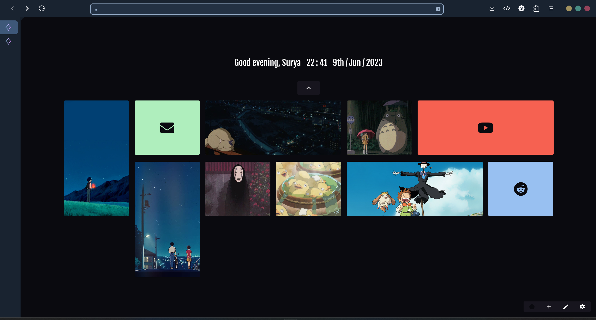
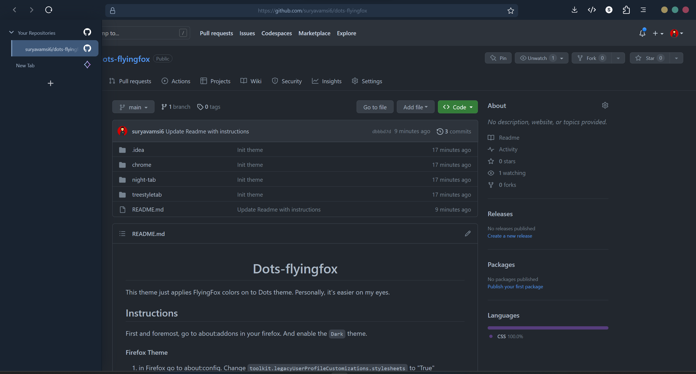

<div align="center">

# Dots-flyingfox

</div>
<div style="display: flex; flex-direction: column;" >
 <div>


</div>
<div>



</div>
</div>

This theme just applies FlyingFox colors on to Dots theme. Personally, it's easier on my eyes.

Switch to dark-theme branch to apply a different theme.

## Instructions

First and foremost, go to about:addons in your firefox. And enable the `Dark` theme.
#### Firefox Theme
1. in Firefox go to about:config. Change `toolkit.legacyUserProfileCustomizations.stylesheets` to "True"
2. Find your profile folder (go to the url `about:profiles` in firefox, and open the folder of your active profile)
3. Copy the `chrome` folder from `dots/firefox` to the aforementioned profile folder.
4. Restart firefox, you theme should be updated

<details>
<summary>
MacOS Fix overlapping controls
</summary>

1. Open this file in your editor: `dotfiles-hyprland/dots/firefox/chrome/window-controls/wc-without-tabline.css`
2. Uncomment the following: (in `:root:not([inFullscreen]) toolbar#nav-bar`
```css
margin-left: calc(
        var(--wc-right-space) * 2 + 60px
    ) !important; 
```
3. Comment in this line:
```css
margin-left: 0px;
```
4. Your file should look like this
```css
@import "window-controls.css";

:root:not([inFullscreen]) toolbar#nav-bar {
    z-index: 1 !important;
    position: relative !important;
    /* shift toolbar to the right based on initial width */
    margin-left: calc(
        var(--wc-right-space) * 2 + 60px
    ) !important; 
    /* margin-left: 0px; */
}

#TabsToolbar .toolbar-items {
    display: none !important;
}

.titlebar-buttonbox {
    flex-direction: row-reverse;
}

#TabsToolbar.browser-toolbar {
    display: inline-block !important;
    position: absolute;
    top: var(--wc-vertical-shift) !important;
    left: var(--wc-left-space) !important;
}
```
</details>

<details>
<summary>
Windows: Window Control Buttons At the Right Side
</summary>

The solution is to replace this line: (in `chrome/config.css`)
```css
@import "window-controls/wc-without-tabline.css";
```
with the following:
```css
@import "window-controls/wc-without-tabline-r.css";
```
Afterwards your buttons should be visible.
</details>

#### Tree Style Tabs
1. Install the Tree Style Tabs extension from [here](https://addons.mozilla.org/en-US/firefox/addon/tree-style-tab/)
2. Visit `Preferences` with `ctrl+shift+a>Tree Style Tab>Preferences`
3. Scroll to the bottom, and Press `Import` in `All Configs`
4. Import the `config.json` from `dots/firefox/treestyletab/config.json`
5. Then go to `Advanced` and scroll down
6. Choose `Load from file` and upload the following `dots/firefox/treestyletab/treestyletab.css` (*optional*: if the theme of TST doesn't match the new firefox theme)

#### Night Tab
1. Install the nighttab extension from [here](https://addons.mozilla.org/en-US/firefox/addon/nighttab/)
2. Go to night tab settings (top right), and then the data tab
3. Import `dots/firefox/night-tab/night-tab.json`
4. You'll have to change the colors yourself if you change the theme from the default
5. You can change the name to yours by going to Night Tab Settings > Header > Name
# ⭐ Credits

- [AmadeusWM](https://github.com/AmadeusWM): for the original theme - [dotfiles-hyprland](https://github.com/AmadeusWM/dotfiles-hyprland)
- [Akshat Sharma](https://github.com/akshat46): for FlyingFox - [FlyingFox](https://github.com/akshat46/FlyingFox)